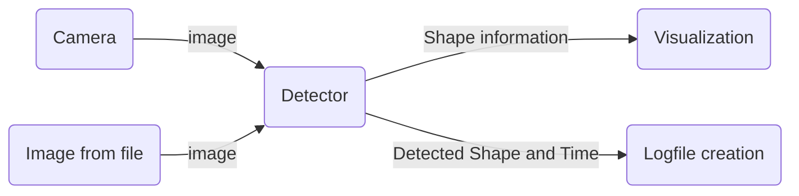

# ShapeFinder

A program to find simple shapes in realtime. Written as part of the Software Engineering course in 2023.

## Architecture

The ShapeFinder consists mainly of a class, which is able to detect shapes based on an input image or a live camera feed, a log file creator and an overlay of the detected shape.



```mermaid
    sequenceDiagram


```