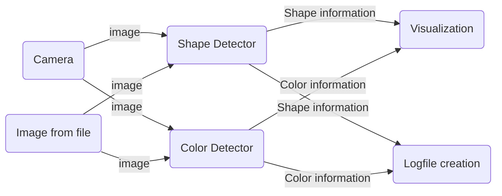
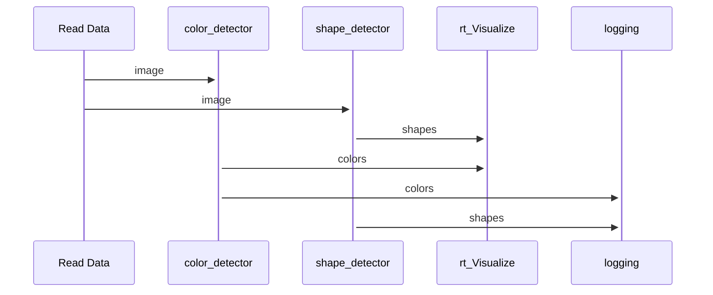

# ShapeFinder

## Introduction and Goals
A program to detect shapes and their colors in real time.
Shape, color and contours are displayed on the image/camera feed in realtime. 
A log with the previous mentioned variables is being written.

Programmed as part of the Software Engineering course in 2023.

## Context and Scope
The scope of this project is to write a small python application that uses the
livestream of a camera and performs real-time object pattern recognition and color detection.
The recognition is visualized within the livestream and the information gathered is logged into a csv file for later analysis. 

### Following:

Object Pattern Recognition: The application can detect a square, a triangle, a circle and a rectangle.

Color Detection: The application can detect red, green, blue, yellow and violet in their prominent variants.

Real-time Visualization: Overlay recognized objects with their respective patterns and colors on the
live video/image,
Data Loggin: Log timestamps, pattern type and detected color, information is stored in a csv file.

## Solution Strategy

## Building Block View (von euch erstelltes Komponentendiagram)

## Runtime View (Ein dynamisches Sequenz Diagramm, wie die SW funktioniert)

## Architectural Decisions 
The ShapeFinder consists of 4 classes, one for color detection one for shape detection two smaller ones, one for logging and one for rtVisualization.
They are kept separetly to have a good maintainability 

## Risks and Technical Depts

## Glossary (falls was vorkommt, was man nicht auf Anhieb versteht)
