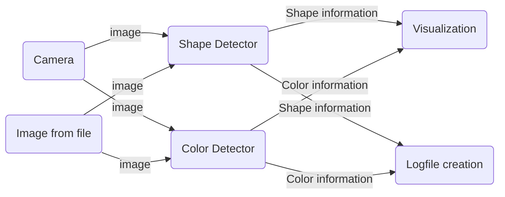
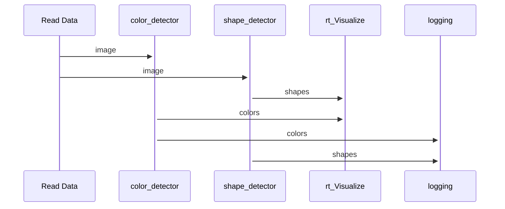

# ShapeFinder

## Introduction and Goals
A program to detect shapes and their colors in real time.
Shape, color and contours are displayed on the image/camera feed in realtime. 
A log with the previous mentioned variables is being written.
Programmed as part of the Software Engineering course in 2023.

## Context and Scope
The scope of this project is to write a small python application that uses the
livestream of a camera and performs real-time object pattern recognition and color detection.
The recognition is visualized within the livestream and the information gathered is logged into a csv file for later analysis. 

### Features:

Object Pattern Recognition: The application can detect a square, a triangle, a circle and a rectangle.

Color Detection: The application can detect red, green, blue, yellow and violet in their prominent variants.

Real-time Visualization: Overlay recognized objects with their respective patterns and colors on the
live video/image,

 Data Loggin: Log timestamps, pattern type and detected color, information is stored in a csv file.

## Solution Strategy
The task was accomplished by splitting the task in four main classes. One for each goal we had to achieve. 
### Our Classes
<color_detector> for recognizing the color of our shape. 
<shape_detector> for detecting the kind of shape.  
<data_logging> for logging the color, shape and time when we detect a new shape. 
<rt_visualization> for real time visualization of the shape contours, name and form. 

### How it works
We detect the contours of the shape first, based on the contours we can evaluate what kind of shape we have.The contours also allow us to extract and use the coordinates from the middle of the shape and pass it to our color detector.
Afterwards we take the bgr value from the passed coordinates, convert it into hsv and put the detected color into an array.
If the shape and color are detected, we put their values into a log file and display it in real time with an additional timestamp.

## Building Block View 

## Runtime Viev

## Architectural Decisions 
As mentioned the shapeFinder conists of four main classes.
This was implemented to give every task we had to accomplish a class, so that there is a dedicated workspace for everything.
Keeping it seperately also allows for easier implementation of future features, general overview and maintainability.

## Risks and Technical Debt
1. Using the program under a not sufficent enough light source can reduce the wished result. 
The program is only calibrated for ideal light conditions and shape image quality.

2. If the background is not uniformly the program can not work properly.

3. Shapes which aren't enitrely flat can rise issues and have a chance of not been properly evaluated.

